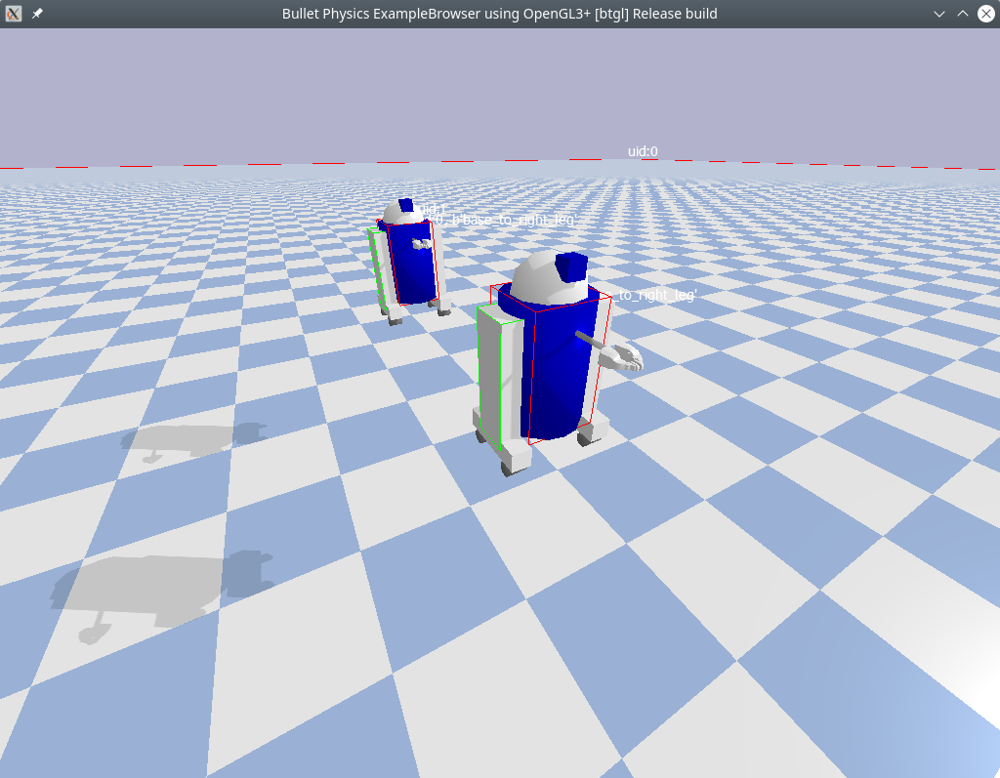

# PyBulletWrapper
A convenient, gym-like wrapper for PyBullet

# Prerequisites
You need PyBullet of course. You can install PyBullet via command line:

```bash
$ pip install pybullet
```

# Usage
You can use this repository as a template of your project:

```bash
$ git clone https://github.com/liusida/PyBulletWrapper.git
$ cd PyBulletWrapper
$ python demo.py
```

Or, you can use this repository as a submodule of your project:

```bash
/your/repo$ git submodule add https://github.com/liusida/PyBulletWrapper.git
/your/repo$ ls
main.py PyBulletWrapper
```

and in `main.py`, you can use the wrapper:

```Python
import pybullet as p
from PyBulletWrapper.pybullet_wrapper.base import BaseWrapperPyBullet
from PyBulletWrapper.pybullet_wrapper.handy import HandyPyBullet

p = BaseWrapperPyBullet(p)
p = HandyPyBullet(p)
p.start() # shortcut for p.connect(p.GUI)
while True:
    p.stepSimulation()
    p.sleep()
```

# Demos
`demo2.py` is a more complicated demo that you can take a look. (Tip: you can use `Ctrl+Mouse` to control the camera in the pybullet Window.)



# Contribute
You are very welcome to make your wrapper and pull request.

Please take a look at the files in the `pybullet_wrapper` folder and use `template.py` as a template to create your wrapper.
